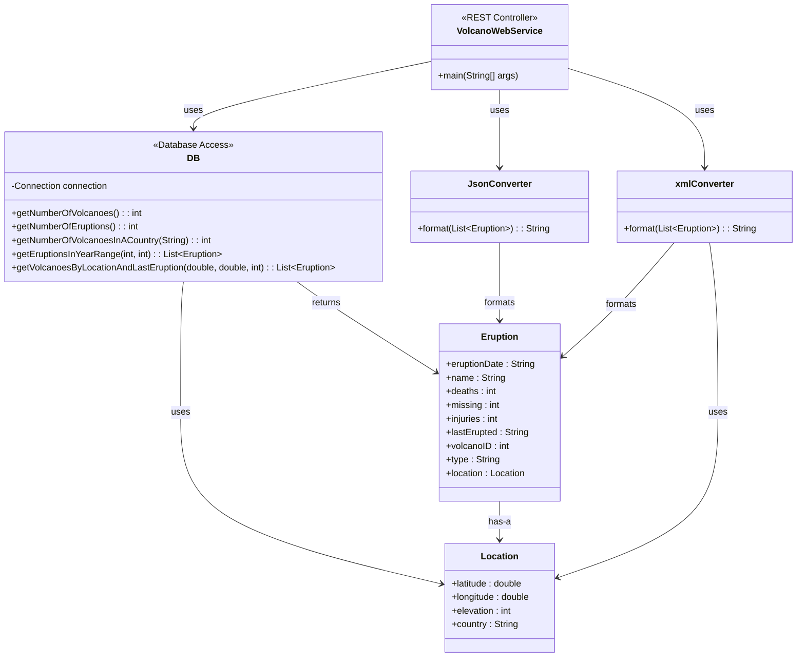

# Volcano Web Service

The **Volcano Web Service** is a Java-based RESTful API that provides information about volcanoes and eruptions. It allows users to query data based on country, year range, and geographical location.

---
## Table of Contents

1. [Features](#features)
2. [Technologies Used](#technologies-used)
3. [Installation & Setup](#installation-setup)
4. [UML](#uml)
5. [Main Classes](#main-classes)
6. [API Endpoints](#api-endpoints)
7. [License](#license)

---

## Features
- Get the total number of volcanoes and eruptions.
- Retrieve the number of volcanoes in a specific country.
- Get eruption details within a specified year range in JSON format.
- Search for volcanoes based on latitude, longitude, and last eruption date in XML format.

---

## Technologies Used
- **Java 8+**
- **Spark Java (Lightweight Web Framework)**
- **JSON Processing (org.json)**
- **XML Processing**
- **JDBC (For database operations)**

---

## Installation & Setup

### Prerequisites
- Java Development Kit (JDK) 8 or later
- Eclipse IDE (or any Java IDE of your choice)
- Apache Maven (for dependency management)
- Database setup with volcano and eruption data

### Steps to Run
1. Clone the repository:
   ```sh
   git clone <https://github.com/adss0/VolcanoWebService.git>
   ```
2. Open the project in **Eclipse** or any Java IDE.
3. Ensure dependencies are set up correctly (e.g., Spark Java, JSON, XML handling, JDBC).
4. Run the `VolcanoWebService.java` file as a **Java Application**.
5. The service will start on `http://localhost:8088/`.

---

## UML

---

## Main Classes

### 1. VolcanoWebService

The **VolcanoWebService** class is the main entry point of the application. It defines all the routes and handles HTTP requests using the **Spark Java** framework. This class interacts with the `DB` class to retrieve data from the SQLite database.

### 2. DB

The **DB** class is responsible for managing the database connection and executing SQL queries. It connects to the SQLite database containing the volcano and eruption data and provides methods to retrieve information from the database.

**Key Methods:**
- `getNumberOfVolcanoes()`: Returns the total count of volcanoes in the database.
- `getNumberOfEruptions()`: Returns the total count of eruptions.
- `getNumberOfVolcanoesInACountry()`: Retrieves the number of volcanoes in a specific country.
- `getEruptionsInYearRange()`: Fetches eruptions that occurred within a given year range.
- `getVolcanoesByLocationAndLastEruption()`: Retrieves volcanoes by location and filters by the last eruption date.

### 3. Location

The **Location** class is a helper data class representing the geographical coordinates of a volcano. It also contains additional information such as the elevation and the country of the volcano.

### 4. Eruption

The **Eruption** class represents an eruption event. It stores details about the eruption, including the date, the volcano's name, its geographical location, and statistics on casualties (deaths, injuries, and missing persons).
## API Endpoints

### Test the Service
**GET** `/test`
- Example: `http://localhost:8088/test`
- Response:
  ```text
  Number of volcanoes: 1604
  Number of eruptions: 855
  ```

### Get Number of Volcanoes in a Country
**GET** `/country?search={country_name}`
- Example: `http://localhost:8088/country?search=Japan`
- Response: `113` (Number of volcanoes in Japan)

### Get Eruptions by Year Range
**GET** `/year?from={start_year}&to={end_year}`
- Example: `http://localhost:8088/year?from=1900&to=2000`
- Returns a list of eruptions in **JSON format** that occurred between the specified start year and end year. 
- Example response format:
    ```json
    [
  {
    "date": "1900",
    "injuries": 0,
    "name": "Tullu Moye",
    "missing": 0,
    "location": {
      "elevation": 2343,
      "country": "Ethiopia",
      "latitude": 8.159,
      "longitude": 39.137
    },
    "deaths": 0
  },
  {
    "date": "1900-01-22",
    "injuries": 0,
    "name": "Asamayama",
    "missing": 0,
    "location": {
      "elevation": 2568,
      "country": "Japan",
      "latitude": 36.406,
      "longitude": 138.523
    },
    "deaths": 25
  },
    ]
    ```

### Get Volcanoes by Location and Last Eruption Date
**GET** `/location?latitude={lat}&longitude={lon}&erupted_since={year}`
- Example: `http://localhost:8088/location?latitude=35&longitude=13&erupted_since=1800`
- Returns a list of volcanoes **in XML format** located near the specified latitude and longitude, that erupted after the specified year.
- Example response format:
    ```xml
    <Volcano id="809">
<Name>Etna</Name>
<Type>Stratovolcano</Type>
<LastErupted>2018-12-26</LastErupted>
<Location>
<Latitude>37.748</Latitude>
<Longitude>14.999</Longitude>
<Elevation>3357</Elevation>
<Country>Italy</Country>
</Location>
</Volcano>
    ```
---

## License
This project is licensed under the **MIT License**.